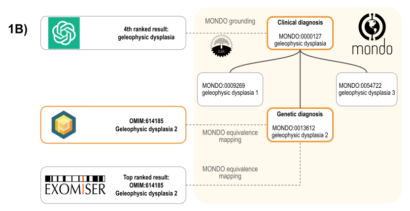

# Scoring
In order to fairly score clinically accurate diagnoses - considering we are only using phenotypic data - we needed to match the grounded answers by an LLM (or by Exomiser) to the correct result present in the phenopacket, consisting of an OMIM identifier. This is illustrated in the image below.
 .

# Statistics

# More TBD