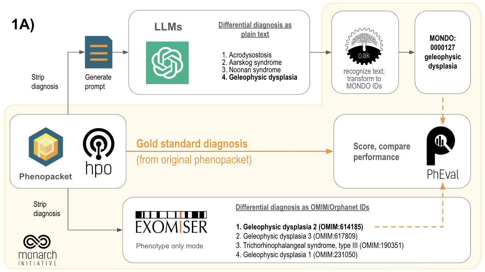

# Welcome to pheval.llm, formerly MALCO

To systematically assess and evaluate an LLM's ability to perform differential diagnostics tasks, we employed prompts programatically created with [phenopacket2prompt](https://github.com/monarch-initiative/phenopacket2prompt), thereby avoiding any patient privacy issues. The original data are phenopackets located at [phenopacket-store](https://github.com/monarch-initiative/phenopacket-store/). A programmatic approach for scoring and grounding results is also developed, made possible thanks to the ontological structure of the [Mondo Disease Ontology](https://mondo.monarchinitiative.org/).

Two main analyses are carried out:
- A benchmark of some openAI GPT-models against a state of the art tool for differential diagnostics, [Exomiser](https://github.com/exomiser/Exomiser). The bottom line, Exomiser [clearly outperforms the LLMs](https://github.com/monarch-initiative/pheval.llm/blob/short_letter/notebooks/plot_exomiser_o1MINI_o1PREVIEW_4o.ipynb).
- A comparison of gpt-4o's ability to carry out differential diagnosis when prompted in different languages. 

## Project layout
The description of the steps we take are found in the figure below .
